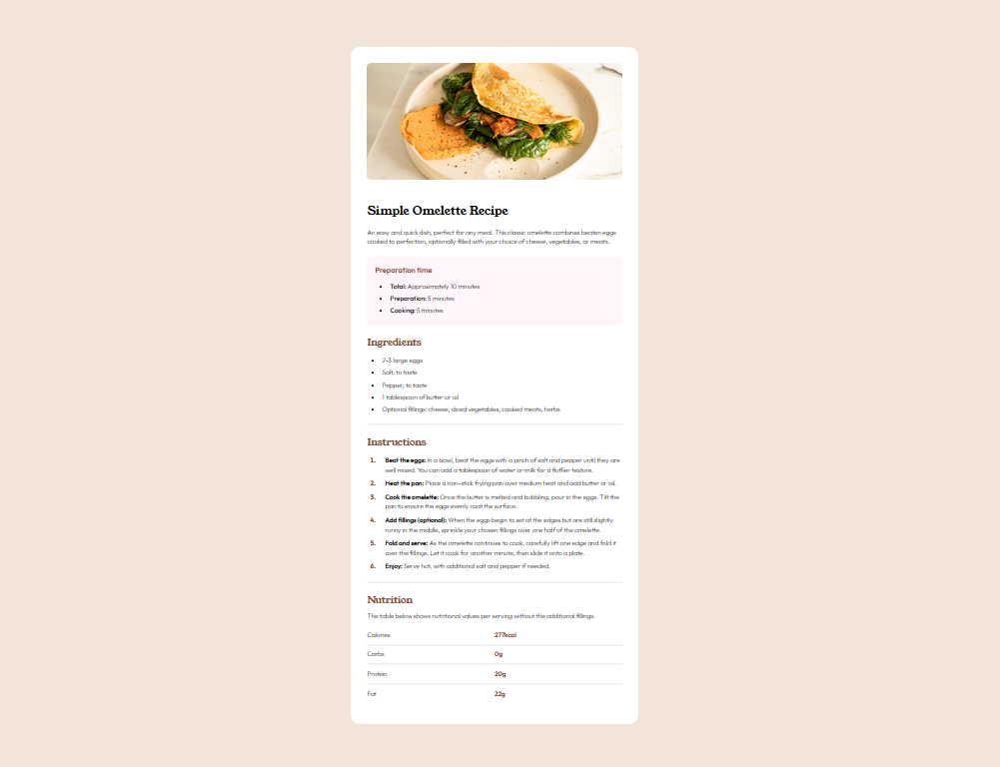

# Frontend Mentor - Recipe page solution

This is a solution to the [Recipe page challenge on Frontend Mentor](https://www.frontendmentor.io/challenges/recipe-page-KiTsR8QQKm). Frontend Mentor challenges help you improve your coding skills by building realistic projects.

## Table of contents

- [Overview](#overview)
  - [The challenge](#the-challenge)
  - [Screenshot](#screenshot)
  - [Links](#links)
- [My process](#my-process)
  - [Built with](#built-with)
  - [What I learned](#what-i-learned)
  - [Continued development](#continued-development)
  - [Useful resources](#useful-resources)
- [Author](#author)

## Overview

### The challenge

The challenge is to build out this recipe page and get it looking as close to the design as possible.

### Screenshot

### Links

- Solution URL: [Github.](https://github.com/juancmdev/recipe_page)
- Live Site URL: [Netlify](https://recipe-page-juancmdev.netlify.app/)

## My process

### Built with

- Semantic HTML5 markup
- CSS custom properties
- Flexbox
- CSS Grid

### What I learned

I have learned to use many css selectors, responsive designe technics an a lot of new things.

### Continued development

I have learned so much with this project, I have reinforced a lot of knowledge and I am happy for this.

### Useful resources

- [w3 School](https://www.w3schools.com/)
- [Mozilla.org](https://www.mozilla.org/es-AR/)

## Author

- Frontend Mentor - [@juancmdev](https://www.frontendmentor.io/profile/juancmdev)
- Linkedin - [@juancmdev](https://www.linkedin.com/in/juan-carlos-moreno-j-14829423b/)
